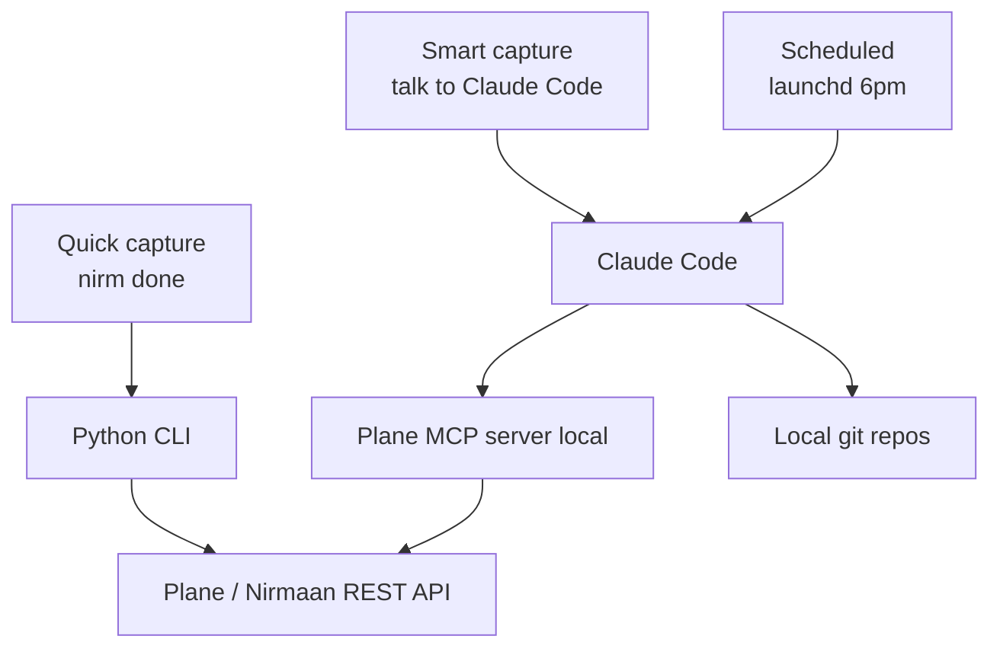

# Nirmaan Bot — Complete Documentation

> Automation that creates and updates Plane (Nirmaan) work items so you stop forgetting to log work.

---

## Table of contents

- [Why this exists](#why-this-exists)
- [Architecture](#architecture)
- [Phases and status](#phases-and-status)
- [Setup](#setup)
- [Configuration reference](#configuration-reference)
- [CLI reference (`nirm`)](#cli-reference-nirm)
- [MCP server reference (`nirmaan-mcp`)](#mcp-server-reference-nirmaan-mcp)
- [API client reference (`PlaneClient`)](#api-client-reference-planeclient)
- [How fields map to Plane](#how-fields-map-to-plane)
- [File structure](#file-structure)
- [Troubleshooting](#troubleshooting)
- [Roadmap (Phase 4)](#roadmap-phase-4)
- [Cost](#cost)
- [Tech stack](#tech-stack)
- [Extending the bot](#extending-the-bot)

---

## Why this exists

The honest version of the problem: opening Plane, picking a state, an estimate, a label, navigating dropdowns — that's seven clicks of friction when you've just finished a task and your brain wants to move on. So tasks go unlogged. End of month, your manager opens Nirmaan and sees a sparse trail of work, even though you actually shipped a lot. That hurts your performance review.

The system attacks this in three layers:

| Layer | When you remember | When you forget |
|---|---|---|
| Python CLI (`nirm`) | Type one command, ticket created in 2 seconds | — |
| Claude Code + MCP (Phase 3) | Ask Claude in plain English | Claude reads git and drafts for you |
| Scheduled digest (Phase 4) | — | `launchd` runs Claude Code at 6 PM, catches everything |

The mental shift: stop trying to remember to log work. The computer logs your work.

---

## Architecture

### Components

**Triggers (top of the system).** Three ways the bot starts working:
1. *Manual CLI* — you type `nirm done "..."` in any terminal.
2. *Smart capture* — you talk to Claude Code: "draft tickets from today's commits."
3. *Scheduled* — `launchd` fires at 6 PM and runs Claude Code in headless mode.

**Bot core (your Mac).** Two things actually run on your machine:
1. *Python CLI* — the `nirm` command. Wraps the API client. Used for instant captures.
2. *Plane MCP server* — exposes API client methods as tools Claude Code can call. Used for smart captures and the scheduled digest.

**External services.** What the bot talks to:
1. *Local git repos* — read by Claude Code via its built-in Bash tool.
2. *Plane / Nirmaan* — REST API at `nirmaan.credresolve.com/api/v1`, authenticated with an API token.

### Mermaid diagram



### Why two interfaces?

The CLI and Claude Code solve different problems:

| | Python CLI | Claude Code + MCP |
|---|---|---|
| Speed | 2 seconds | 30 seconds |
| Requires you to remember? | Yes | No, reads git |
| Writes good titles? | No, you supply them | Yes, drafts from diffs |
| Multiple items at once? | One per command | Groups related commits |
| Knows workspace context? | None | Sees your whole project |
| Can answer questions? | No | "What's open on me?" |

Neither covers the other's case. Together they trap effectively all your work.

---

## Phases and status

| Phase | What | Status |
|---|---|---|
| 1 | Plane API client (Python) | ✅ Done |
| 2 | `nirm` CLI for instant captures | ✅ Done |
| 3 | Plane MCP server for Claude Code (`nirmaan-mcp`) | ✅ Done |
| 4 | `launchd` scheduled digest | ⏳ Planned |

Phases 1 and 2 already deliver the highest-leverage feature: zero-friction logging for work you remember to log. Phases 3 and 4 close the loop on work you forget.

---

## Setup

### Prerequisites

- macOS (the scheduling layer in Phase 4 uses `launchd`)
- Python 3.11+
- `pipx` for installing the CLI as a globally available command
- A Plane / Nirmaan account with API access
- (Phase 3+) A Claude Max subscription, for Claude Code without per-token charges

### One-time install

```bash
unzip nirmaan-bot.zip
cd nirmaan-bot

pipx ensurepath        # adds pipx's bin dir to PATH; restart terminal after

# Install nirmaan-bot with pipx in editable mode
pipx install --editable /full/path/to/nirmaan-bot
```

This installs four globally available commands:

| Command | What it is |
|---|---|
| `nirm` | Main CLI (short alias) |
| `nbot` | Alias for `nirm` |
| `nirmaan` | Alias for `nirm` |
| `nirmaan-mcp` | MCP server (Phase 3) — run by Claude Code |

All four are equivalent entry points; use whichever fits your shell muscle memory.

### Generate a Plane API token

In Nirmaan: **Workspace Settings → API Tokens → Create token**. Save it immediately — you cannot view it again.

### Configure `.env`

```bash
cp .env.example .env
```

Open `.env` and fill in:

```bash
PLANE_BASE_URL=https://nirmaan.credresolve.com
PLANE_API_KEY=<your token>
PLANE_WORKSPACE_SLUG=cr-product
PLANE_PROJECT_ID=                # leave blank for first run
```

**`.env` search order** — both the CLI and MCP server look for config in this order:

1. `.env` in the current directory or any parent (standard `python-dotenv` walk-up)
2. `~/.nirmaan.env` (home-directory fallback — useful for the MCP server which has no working directory)
3. `~/.config/nirmaan/.env`

For the MCP server (which Claude Code launches from an arbitrary directory), put your config in `~/.nirmaan.env` so it is always found.

### Discover IDs with the smoke test

```bash
python scripts/smoke_test.py
```

The first run lists all projects. Copy the ID for **Builder** into `PLANE_PROJECT_ID` in `.env`. Re-run the smoke test — it now lists states, labels, modules, and the current cycle. Copy the IDs you need into the defaults section of `.env`:

```bash
PLANE_DEFAULT_MODULE_ID=<AgentX module UUID>
PLANE_DEFAULT_LABEL_IDS=<Tech label UUID>
PLANE_DEFAULT_ESTIMATE=2
PLANE_DEFAULT_PRIORITY=none
```

The smoke test will offer to create a test ticket. Accept — if it lands in Plane correctly, your setup is verified end-to-end.

### Verify with `nirm doctor`

```bash
nirm doctor
```

Expected output: green check marks for connection, project access, and default module resolution.

---

## Configuration reference

All configuration lives in `.env` (or `~/.nirmaan.env` for global/MCP use). Loaded by `python-dotenv` whenever `PlaneConfig.from_env()` or `BotDefaults.from_env()` runs.

### Required

| Variable | Example | Purpose |
|---|---|---|
| `PLANE_BASE_URL` | `https://nirmaan.credresolve.com` | Plane instance root |
| `PLANE_API_KEY` | `plane_api_xxx...` | Auth token, sent as `X-API-Key` header |
| `PLANE_WORKSPACE_SLUG` | `cr-product` | URL-friendly workspace name |
| `PLANE_PROJECT_ID` | `99f5c5e6-...` | UUID of the project (Builder) |

### Optional

| Variable | Example | Purpose |
|---|---|---|
| `PLANE_MODULE_ID` | `7a823161-...` | Direct module UUID (low-level override, rarely needed) |
| `PLANE_USER_ID` | `aditya-uuid` | Your user UUID — required for `list_my_tickets` MCP tool |
| `PLANE_DEFAULT_MODULE_ID` | `7a823161-...` | Module attached to every new ticket (e.g. AgentX) |
| `PLANE_DEFAULT_LABEL_IDS` | `<tech-uuid>,<other-uuid>` | Comma-separated label UUIDs |
| `PLANE_DEFAULT_ESTIMATE` | `2` | Integer estimate point |
| `PLANE_DEFAULT_PRIORITY` | `none` | One of `urgent / high / medium / low / none` |

### Override hierarchy

For each work item the CLI creates, fields resolve in this order (later wins):

1. `.env` defaults (`PLANE_DEFAULT_*`)
2. Per-command flags (`-p`, `-l`, `-e`, `--module`, etc.)
3. Hardcoded smart defaults (e.g. due date = today when state is Done)

---

## CLI reference (`nirm`)

The CLI is a Typer app. All commands accept `--help`.

### Global behavior

- All commands read `.env` from the current working directory or its parents.
- Failures exit with non-zero status and a red error message via Rich.
- Issue identifiers can be UUIDs or human IDs (`BUILDER-784` or just `784`).

### `nirm done <title>` — create a Done item

```bash
nirm done "fixed OAuth redirect"
```

Auto-fills: state=Done, assignee=you, priority=`none` (or your default), labels=Tech (or your defaults), module=AgentX (or your default), estimate=2 (or your default), **due=today** (smart default for Done items).

### `nirm wip <title>` — create an In Progress item

```bash
nirm wip "starting auth refactor"
```

Same defaults as `done` except state=In Progress and no automatic due date.

### `nirm todo <title>` — create a Todo / Backlog item

```bash
nirm todo "spec retry queue"
```

### Shared flags for `done`, `wip`, `todo`

| Flag | Long | Effect |
|---|---|---|
| `-D` | `--desc` | Description text (plain text, auto-converted to HTML) |
| `-p` | `--priority` | One of `urgent`, `high`, `medium`, `low`, `none` |
| `-l` | `--label` | Add a label by name (repeatable). Adds to defaults; does not replace |
| `-e` | `--est` | Integer estimate point (overrides default) |
| `-d` | `--due` | Due date — see [date parsing](#date-parsing) |
| `-s` | `--start` | Start date — same parsing |
| `-m` | `--module` | Module by name (overrides default) |
| | `--no-module` | Skip the default module entirely |
| | `--parent` | Parent issue UUID |

Examples:

```bash
nirm done "patched login bug" -l Bug -e 1
nirm wip "design spike" -p high --due fri
nirm todo "research idea" --no-module --label Research
```

### `nirm comment <id> <text>` — add a comment

```bash
nirm comment BUILDER-506 "blocked on backend"
nirm comment 506 "using shorter form too"
```

The text is wrapped in `<p>...</p>` and posted as HTML, since Plane stores rich text.

### `nirm move <id> <state>` — transition state

```bash
nirm move BUILDER-506 done
nirm move BUILDER-506 "In Progress"
```

State name match is case-insensitive. If the state doesn't exist, the error message lists the available ones.

### `nirm list` — list work items

```bash
nirm list                      # latest 20
nirm list --state Done -n 5    # 5 most recent Done items
nirm list --state "In Progress"
```

| Flag | Long | Effect |
|---|---|---|
| `-s` | `--state` | Filter by state name |
| `-n` | `--limit` | Max rows (default 20) |

### `nirm show <id>` — show details

```bash
nirm show BUILDER-784
```

Prints state, priority, labels, estimate, due date.

### `nirm doctor` — verify config

```bash
nirm doctor
```

Reports the parsed `.env` defaults and probes the API for connectivity. Use this after every config change.

### Date parsing

Anywhere a date is accepted (`--due`, `--start`):

| Input | Resolves to |
|---|---|
| `today` | Current date |
| `tomorrow` | Current date + 1 day |
| `+3d`, `+7d`, `+14d` | Current date + N days |
| `mon`, `tue`, …, `sun` | Next occurrence of that weekday (next week if today is that day) |
| `2026-05-15` | ISO date as-is |

Anything else is passed through as ISO and Plane validates it.

---

## MCP server reference (`nirmaan-mcp`)

Phase 3 is **complete**. The MCP server lives in `nirmaan/mcp_server.py` and is registered with Claude Code via:

```bash
claude mcp add nirmaan -- nirmaan-mcp
```

Or add to `~/.claude/claude_desktop_config.json` (for Claude Desktop):

```json
{
  "mcpServers": {
    "nirmaan": {
      "command": "nirmaan-mcp"
    }
  }
}
```

The server reads config from `~/.nirmaan.env` (set it there so it works regardless of Claude's working directory).

### MCP tools exposed to Claude

| Tool | What it does |
|---|---|
| `list_my_tickets(state?, limit, include_done)` | Your tickets (created by you + assigned to you). Requires `PLANE_USER_ID`. |
| `list_workspace_members()` | All members — use this to find your `PLANE_USER_ID`. |
| `get_ticket(identifier)` | Full details for a ticket (e.g. `BUILDER-784`). |
| `create_ticket(title, ...)` | Create a new ticket. Defaults to `Todo` state. |
| `start_ticket(title, ...)` | Create a ticket in `In Progress` with `start=today`. |
| `done_ticket(title, ...)` | Create a ticket in `Done` with `due=today`. |
| `update_ticket(identifier, ...)` | Update title, description, priority, estimate, dates. |
| `transition_state(identifier, state)` | Move a ticket to a named state. |
| `add_comment(identifier, text)` | Post a comment (plain text auto-converted to HTML). |
| `list_states()` | All state names in the project. |
| `list_labels()` | All label names. |
| `list_modules()` | All module names. |
| `get_current_cycle()` | The active sprint/cycle, or `null`. |

### Example Claude prompts (with MCP active)

```
"Mark BUILDER-506 done and add a comment that QA is taking over."
"What's open on me this cycle? Group by label."
"I just merged the OAuth fix — find the matching ticket and close it."
"Log today's work: I finished the retry queue and reviewed PR #42."
```

### First-time setup checklist

1. `nirm doctor` — confirm CLI works
2. Add `PLANE_USER_ID` to `~/.nirmaan.env` (use `list_workspace_members` tool or `smoke_test.py` to find your UUID)
3. `claude mcp add nirmaan -- nirmaan-mcp` — register with Claude Code
4. Ask Claude: *"list my open tickets"* — if it responds with a table, Phase 3 is live

---

## API client reference (`PlaneClient`)

Located in `nirmaan/plane_client.py`. Used directly by the CLI and (in Phase 3) by the MCP server.

### `PlaneConfig`

Dataclass holding all connection settings. Built from `.env` via `PlaneConfig.from_env()`.

```python
from nirmaan import PlaneConfig

cfg = PlaneConfig.from_env(require_project=True)
# require_project=False allows discovery (e.g. listing projects)
# before you know the project ID.
```

Fields: `base_url`, `api_key`, `workspace_slug`, `project_id`, `user_id`.

### `PlaneClient`

Thin synchronous wrapper around the Plane REST API, built on `httpx`.

```python
from nirmaan import PlaneClient, PlaneConfig

with PlaneClient(PlaneConfig.from_env(require_project=True)) as c:
    issue = c.create_issue(name="hello")
```

Always use as a context manager so the underlying HTTP connection closes cleanly.

### Discovery methods (no project ID required)

| Method | Returns | Notes |
|---|---|---|
| `list_projects()` | `list[dict]` | All projects in the workspace |
| `list_workspace_members()` | `list[dict]` | For looking up assignee UUIDs |

### Project metadata

| Method | Returns |
|---|---|
| `list_states()` | All workflow states |
| `list_cycles()` | All cycles |
| `list_labels()` | All labels |
| `list_modules()` | All modules |
| `get_current_cycle()` | The active cycle (date-range based), or `None` |

### Issue (work item) operations

| Method | Returns |
|---|---|
| `list_issues(**filters)` | Filtered issues; filters become query params |
| `get_issue(issue_id)` | Single issue by UUID |
| `search_issues(query)` | Workspace-level search by identifier or keyword (fast, avoids full scan) |
| `create_issue(name, ...)` | Created issue dict |
| `update_issue(issue_id, **fields)` | Updated issue |
| `add_comment(issue_id, comment_html)` | Comment dict |
| `add_issue_to_module(module_id, issue_id)` | Module attachment (single issue) |
| `add_issues_to_module(module_id, issue_ids)` | Module attachment (batch) |
| `list_module_issues(module_id)` | All issues in a module |

### `create_issue` parameters

```python
client.create_issue(
    name="...",                # required, the title
    description_html="<p>...</p>",
    state_id="...",            # UUID; use find_state() to look up by name
    priority="none",           # urgent / high / medium / low / none
    assignee_ids=["..."],      # list of user UUIDs
    label_ids=["..."],         # list of label UUIDs
    estimate_point=2,
    start_date="2026-05-10",   # ISO
    target_date="2026-05-15",  # ISO
    parent="<issue-uuid>",
    module_ids=["..."],        # attached after creation via sub-endpoint
)
```

### Convenience helpers (name → UUID lookups)

| Method | Use |
|---|---|
| `find_state("Done")` | State dict or `None` |
| `find_label("Tech")` | Label dict or `None` |
| `find_module("AgentX")` | Module dict or `None` |
| `transition_state(issue_id, "Done")` | Move an issue to a named state |

All matches are case-insensitive.

### Metadata caching

States, labels, and modules are cached in-memory for **5 minutes** per client instance. This collapses bursts of `find_state` / `find_label` / `find_module` lookups into a single API round-trip. Call `client.invalidate_metadata_cache()` if you create a new state/label/module mid-session and need immediate visibility.

### Error handling

| Exception | When raised |
|---|---|
| `PlaneError` | Any non-2xx response or network failure |
| `PlaneModuleAttachError` | Issue was **created** successfully but module attachment failed. The created issue dict is on `e.issue` — don't treat it as a lost write. |

```python
from nirmaan.plane_client import PlaneError, PlaneModuleAttachError

try:
    issue = client.create_issue(name="hello", module_ids=["..."])
except PlaneModuleAttachError as e:
    print(f"Created {e.issue['sequence_id']} but module attach failed: {e}")
except PlaneError as e:
    print(f"Plane rejected the request: {e}")
```

---

## How fields map to Plane

Every field on Plane's right-hand Properties panel has a defined behavior in the CLI:

| Plane field | Auto-filled by | Override flag |
|---|---|---|
| State | Verb (`done` → Done, `wip` → In Progress, `todo` → Todo) | n/a (verb sets it) |
| Assignees | Token owner (you) | n/a (Plane auto-assigns to creator) |
| Priority | `PLANE_DEFAULT_PRIORITY` | `-p / --priority` |
| Created by | Token owner (you), set by Plane | n/a (not editable) |
| Start date | None, except WIP optionally | `-s / --start` |
| Due date | `today` for Done; otherwise none | `-d / --due` |
| Estimate | `PLANE_DEFAULT_ESTIMATE` | `-e / --est` |
| Modules | `PLANE_DEFAULT_MODULE_ID` | `-m / --module`, `--no-module` |
| Cycle | None (planned for Phase 3) | n/a yet |
| Parent | None | `--parent` |
| Labels | `PLANE_DEFAULT_LABEL_IDS` | `-l / --label` (additive) |

The default zero-flag invocation:

```bash
nirm done "fixed OAuth"
```

…produces a ticket equivalent to BUILDER-506 (the kind you've been making manually) but with no clicks and no menu navigation.

---

## File structure

```
nirmaan-bot/
├── README.md                  # short setup; this file is the deep dive
├── DOCUMENTATION.md           # ← you are here
├── .env                       # secrets — gitignored
├── .env.example               # template
├── .gitignore
├── requirements.txt
├── pyproject.toml             # package metadata + all entry points
│
├── nirmaan/                   # the package itself
│   ├── __init__.py            # re-exports PlaneClient, PlaneConfig, PlaneError
│   ├── plane_client.py        # API client — the foundation
│   ├── cli.py                 # the `nirm` / `nbot` / `nirmaan` commands
│   └── mcp_server.py          # the `nirmaan-mcp` MCP server (Phase 3)
│
└── scripts/
    └── smoke_test.py          # one-shot verifier — list projects/states/labels
```

### Module responsibilities

- **`plane_client.py`** — HTTP and the API surface. No CLI concerns. No business logic. Just translate Python calls into Plane HTTP requests and back. Includes in-memory metadata caching (5-min TTL).
- **`cli.py`** — User experience. Argument parsing, defaults, smart fallbacks (like "Done items get due=today"), pretty terminal output. Delegates all real work to `plane_client`.
- **`mcp_server.py`** — MCP protocol shim. Wraps `PlaneClient` as tools Claude Code can call. Thin layer; all business logic stays in `plane_client`.
- **`scripts/smoke_test.py`** — Verifier. Run after install, after config changes, or when something looks off. Does not modify state unless you confirm a test ticket creation.

---

## Troubleshooting

### `which nirm` returns nothing or a system path

You either didn't install the package with `pipx`, or pipx's bin directory is not on your `PATH`. Check:

```bash
pipx ensurepath        # restart terminal after this if it changes PATH
pipx list              # should include nirmaan-bot
which nirm             # should point inside pipx's bin directory
nirm --help
```

If `which nirm` still points somewhere unexpected, reinstall the editable package:

```bash
pipx uninstall nirmaan-bot
pipx install --editable /full/path/to/nirmaan-bot
```

### 401 Unauthorized

The API token is invalid, missing, or revoked. Regenerate in Workspace Settings → API Tokens, paste into `.env`.

### 404 on a specific endpoint

Two possibilities:
- The workspace slug or project ID is wrong. Run `nirm doctor` to confirm.
- Your self-hosted Plane version uses a different endpoint path. Check `https://docs.plane.so` for the live API reference; adjust paths in `plane_client.py`.

### `add_issue_to_module` fails but the ticket was created

The issue creation and module attachment are separate API calls. If the second fails, you'll have a ticket without the module. Add it manually in Plane, or call:

```python
client.add_issue_to_module(module_id, issue_id)
```

If this consistently fails, your Plane version uses a different module endpoint — check the docs.

### Connection refused / timeout

Network issue. If Nirmaan is behind a corporate VPN, make sure it's connected. Try `curl https://nirmaan.credresolve.com/api/v1/` — you should get *something* (even an auth error is fine).

### `nirm doctor` says default module not found

The UUID in `PLANE_DEFAULT_MODULE_ID` doesn't match any module returned by `list_modules()`. Either:
- The UUID is stale (module was deleted/recreated)
- You're pointing at the wrong project (`PLANE_PROJECT_ID` mismatch)

Re-run the smoke test, copy the current AgentX UUID, and update `.env`.

---

## Roadmap (Phase 4)

### Phase 3 — Plane MCP server ✅ Done

See [MCP server reference](#mcp-server-reference-nirmaan-mcp) above.

### Phase 4 — Scheduled digest (~10 minutes of config)

A `~/Library/LaunchAgents/com.nirmaan.digest.plist` file that fires `claude --print "<prompt>"` daily at 6 PM. The prompt instructs Claude Code to:

1. Read git log for today across configured repos
2. Identify commits that don't have corresponding Plane tickets
3. Draft tickets via the MCP server
4. Either auto-create them or post drafts to a notification for confirmation

**Effort:** the plist is ~20 lines of XML; the prompt is ~10 lines of natural language. Most of the magic is in Claude Code, which you don't have to write.

### Phase 5 — Mobile / remote access (optional)

If you want to update tickets from your phone, host the MCP server somewhere reachable from the Claude.ai mobile app:
- Cloudflare Workers (free tier)
- Tailscale exposing your Mac directly
- Fly.io / Railway

Tradeoffs documented in the conversation history; not required for the core workflow.

---

## Cost

The system is genuinely free *on the margin* — you don't open any new line items on any bill.

| Component | Typical cost | Your cost | Why |
|---|---|---|---|
| Plane / Nirmaan | $10/user/mo | $0 | Employer pays |
| LLM brain (Phase 3+) | $5–30/mo via API | $0 | Bundled in Claude Max |
| Server / hosting | $5–20/mo cloud | $0 | Runs on your Mac |
| Scheduler | varies | $0 | macOS `launchd` is built in |
| Python + libraries | free | $0 | All open source |

**Honest caveats:**
- You're paying for Claude Max regardless. That cost predates this project.
- Heavy Claude Code usage could brush Max's fair-use limits, but a daily digest is one short conversation per day — well under any plausible cap.

---

## Tech stack

| Layer | Choice | Why |
|---|---|---|
| Language | Python 3.11+ | Stdlib's strong, ecosystem mature, fast to write |
| HTTP | `httpx` | Modern, sync + async support, sane defaults |
| CLI framework | `typer` | Type-hint driven, automatic `--help`, friendly errors |
| Terminal output | `rich` | Tables, colors, progress; readable in dark and light |
| Config loading | `python-dotenv` | Standard pattern for `.env` files |
| LLM (Phase 3+) | Claude Code via Claude Max | No per-token billing, bundled with subscription |
| MCP framework (Phase 3) | `mcp` (Python SDK) | Official protocol implementation |
| Scheduler (Phase 4) | macOS `launchd` | Native, reliable, no extra daemon |
| State (Phase 4) | SQLite via stdlib | Tracks last-processed commit, dedupes drafts |

### What is NOT in the stack and why

- **No n8n / Zapier / Make.** A 400-line Python project doesn't need a workflow engine. Adding one would mean hosting overhead and visual-editor maintenance for very little gain.
- **No `ANTHROPIC_API_KEY`.** Claude Code via Max replaces direct API calls, eliminating per-token billing.
- **No async/await.** The CLI is interactive and short-lived; sync `httpx` is simpler and just as fast for this volume.
- **No FastAPI / web server.** Nothing here serves HTTP. The MCP server (Phase 3) talks over stdio by default.
- **No Docker.** Local Python on Mac. Adding Docker would slow startup and add a deploy step.

---

## Extending the bot

### Add a new CLI command

1. Open `nirmaan/cli.py`
2. Add a new function decorated with `@app.command()`
3. Call into `_client()` and the `PlaneClient` methods you need
4. Re-run `pipx install --force --editable /full/path/to/nirmaan-bot` if you changed entry points in `pyproject.toml`

Example: a `nirm mine` command listing only your open tickets:

```python
@app.command()
def mine(state: Optional[str] = typer.Option("In Progress", "-s", "--state")):
    """Show issues currently assigned to you."""
    with _client() as c:
        # ... use c.list_issues() with assignee filter
```

### Add a new method to the API client

1. Open `nirmaan/plane_client.py`
2. Add a method that calls `self._request(...)` with the right HTTP method and path
3. Use `_unwrap_results` if Plane returns paginated lists
4. Add a docstring and a type hint on the return

### Verify changes

After editing any file:

```bash
python -c "from nirmaan import PlaneClient, PlaneConfig"   # syntax check
nirm doctor                                                  # config + connectivity
python scripts/smoke_test.py                               # end-to-end probe
```

If all three pass, your edit is safe.

---

## License

Internal tool, no license. Don't share the API token.

## Maintainer

You. The whole thing is ~500 lines of Python — read it, change it, own it.
